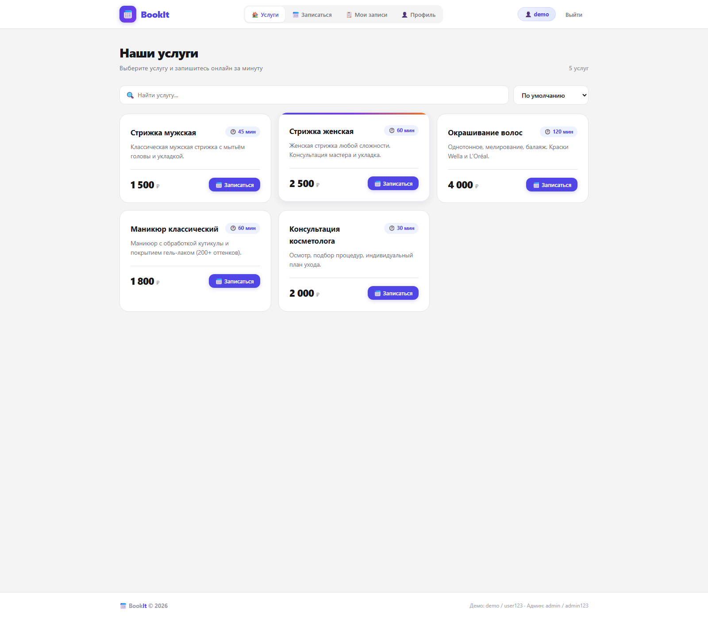
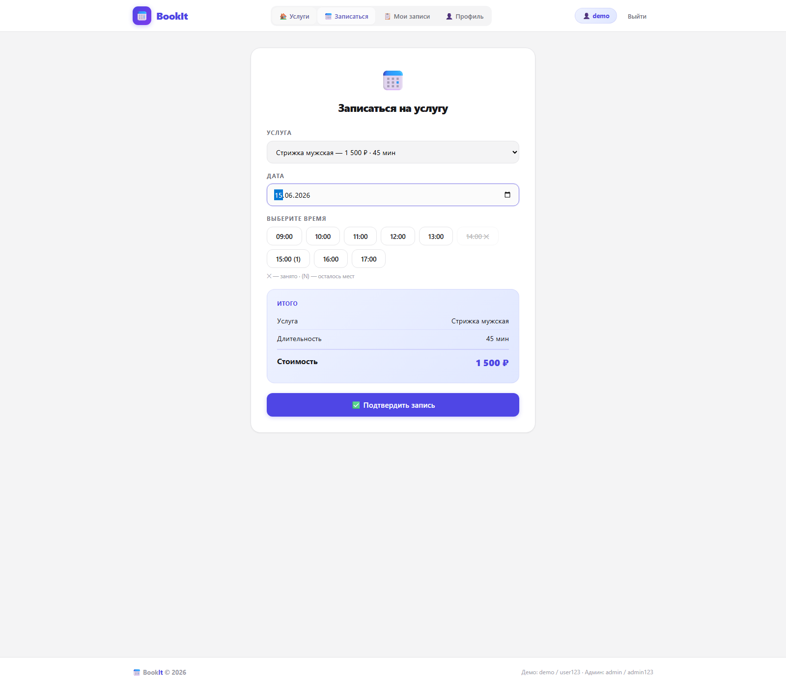
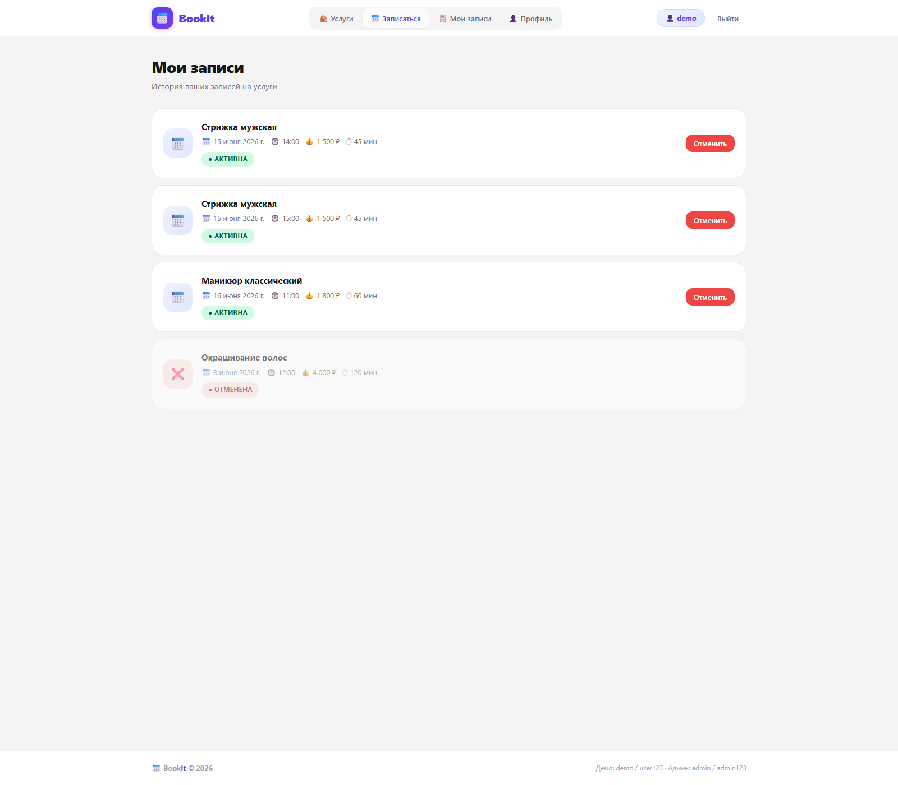
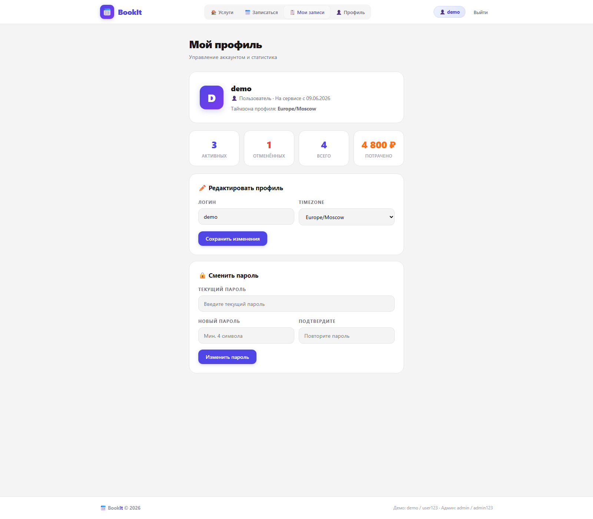
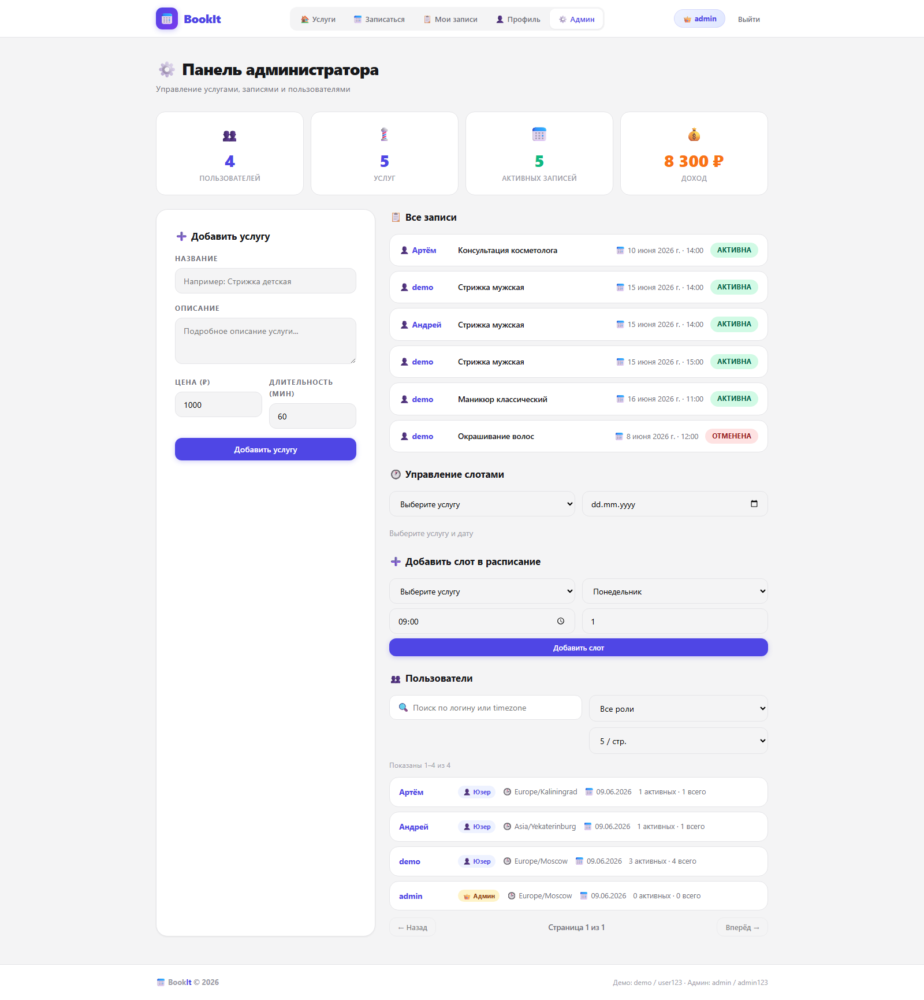

# 📅 BookIt — система онлайн-записи

BookIt — веб-приложение для онлайн-записи на услуги.  
Пользователь регистрируется, выбирает услугу и свободный слот, управляет своими записями и профилем.  
Администратор управляет услугами, слотами, пользователями и видит статистику.

> 🏫 Производственная практика · Группа 3ИП-4-23 · ГБПОУ «ИТ.Москва»


## Что реализовано

- Регистрация, вход, выход и JWT-аутентификация через HttpOnly cookie.
- Профиль пользователя: просмотр, `PUT /api/profile`, смена пароля, timezone.
- Каталог услуг с поиском и сортировкой.
- Запись на услугу с проверкой занятых слотов и `max_bookings`.
- Просмотр, отмена и история собственных записей.
- Админ-панель: статистика, услуги, слоты, пользователи.
- Поиск, фильтрация и пагинация пользователей в админке.
- Строгая работа с timezone и проверка прошедших дат/времени.
- Документация: UML, ER, OpenAPI, Postman Collection и скриншоты.

## Документация

- [OpenAPI / Swagger](docs/openapi.yaml)
- [Postman Collection](postman/BookIt.postman_collection.json)
- [UML Diagram](docs/uml.md)
- [ER Diagram](docs/er.md)
- [Чек-лист тестирования](TESTING.md)

## Скриншоты

### Главная


### Запись


### Мои записи


### Профиль


### Админ-панель


## Технологии

- Frontend: HTML5, CSS3, Vanilla JavaScript
- Backend: Node.js, Express
- База данных: SQLite
- Аутентификация: JWT + HttpOnly cookies
- Безопасность: bcryptjs, express-rate-limit, sanitization
- Архитектура: REST API + SPA

## Быстрый запуск

### Требования

- Node.js 18+
- npm 9+

### 1. Установка зависимостей

```bash
cd backend
npm install
```

### 2. Заполнение базы тестовыми данными

```bash
npm run seed
```

### 3. Запуск сервера

```bash
npm start
```

### 4. Открыть приложение

```text
http://localhost:3000
```

Сервер отдаёт и API, и фронтенд. Отдельный запуск фронтенда не нужен.

## Тестовые аккаунты

| Роль | Логин | Пароль | Доступ |
|------|-------|--------|--------|
| Администратор | `admin` | `admin123` | Все функции + панель управления |
| Пользователь | `demo` | `user123` | Запись, профиль, свои записи |
| Пользователь | `Андрей` | `test123` | Запись, профиль, свои записи |

## Основные API

### Аутентификация

| Метод | Путь | Назначение |
|------|------|------------|
| `POST` | `/api/register` | Регистрация |
| `POST` | `/api/login` | Вход |
| `POST` | `/api/logout` | Выход |
| `GET` | `/api/me` | Текущий пользователь |

### Услуги и слоты

| Метод | Путь | Назначение |
|------|------|------------|
| `GET` | `/api/services` | Список услуг, поиск и сортировка |
| `GET` | `/api/services/:id` | Детали услуги |
| `GET` | `/api/available-slots?service_id=&date=` | Доступные слоты |
| `GET` | `/api/bookings/busy-times?service_id=&date=` | Занятые слоты |
| `POST` | `/api/admin/services` | Добавить услугу |
| `DELETE` | `/api/admin/services/:id` | Удалить услугу |
| `POST` | `/api/slots` | Добавить слот |
| `DELETE` | `/api/slots/:id` | Деактивировать слот |

### Записи

| Метод | Путь | Назначение |
|------|------|------------|
| `POST` | `/api/bookings` | Создать запись |
| `GET` | `/api/bookings/my` | Мои записи |
| `DELETE` | `/api/bookings/:id` | Отменить запись |
| `GET` | `/api/bookings/admin/all` | Все записи для админа |

### Профиль

| Метод | Путь | Назначение |
|------|------|------------|
| `GET` | `/api/profile` | Профиль и статистика |
| `PUT` | `/api/profile` | Обновить username и timezone |
| `PUT` | `/api/profile/password` | Сменить пароль |

### Админка

| Метод | Путь | Назначение |
|------|------|------------|
| `GET` | `/api/admin/stats` | Общая статистика |
| `GET` | `/api/admin/users` | Поиск, фильтр и пагинация пользователей |

## Структура проекта

```text
booking/
├── backend/
│   ├── db/
│   │   ├── index.js
│   │   └── seed.js
│   ├── lib/
│   │   └── time.js
│   ├── middleware/
│   │   └── auth.js
│   ├── routes/
│   │   ├── auth.js
│   │   ├── admin.js
│   │   ├── bookings.js
│   │   ├── profile.js
│   │   ├── services.js
│   │   └── slots.js
│   └── server.js
├── frontend/
│   ├── css/style.css
│   ├── index.html
│   └── js/
│       ├── api.js
│       └── app.js
├── docs/
│   ├── openapi.yaml
│   ├── er.md
│   ├── uml.md
│   └── screenshots/
├── postman/
│   └── BookIt.postman_collection.json
├── README.md
└── TESTING.md
```

## Примечания

- Таймзона пользователя хранится в профиле и используется при проверке дат и времени.
- `max_bookings` поддерживает несколько записей на один слот, но не больше заданного лимита.
- Для просмотра API удобно использовать OpenAPI, а для ручной проверки — Postman Collection.

