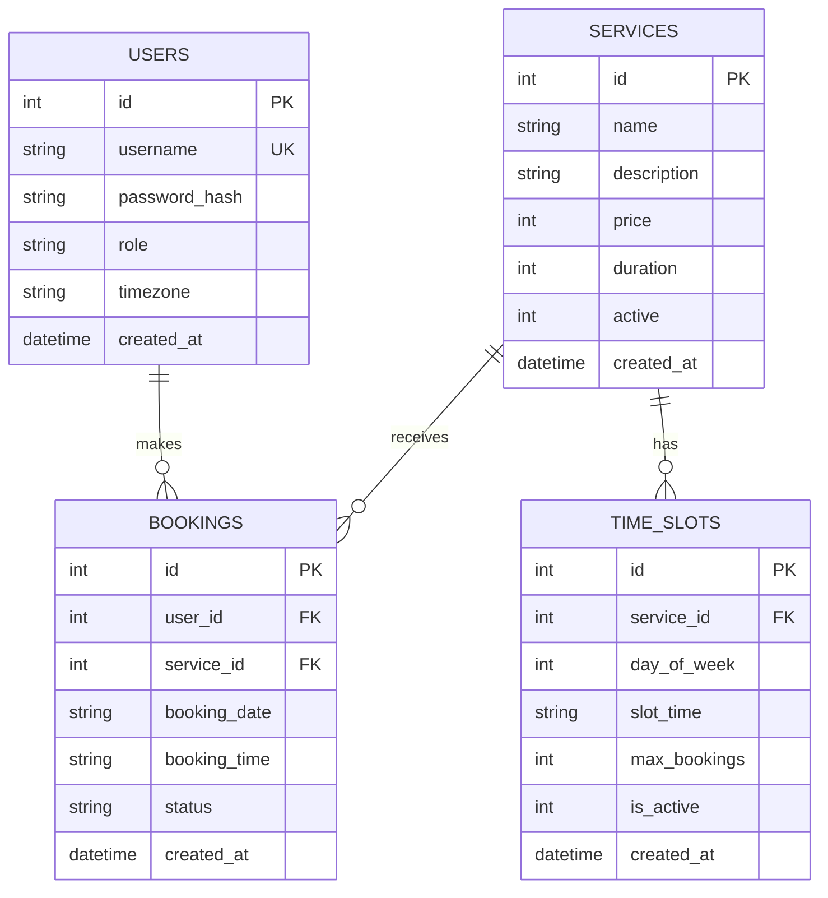

# ER Diagram

Связи базы данных BookIt.

```mermaid
erDiagram
  USERS {
    int id PK
    string username UK
    string password_hash
    string role
    string timezone
    datetime created_at
  }

  SERVICES {
    int id PK
    string name
    string description
    int price
    int duration
    int active
    datetime created_at
  }

  BOOKINGS {
    int id PK
    int user_id FK
    int service_id FK
    string booking_date
    string booking_time
    string status
    datetime created_at
  }

  TIME_SLOTS {
    int id PK
    int service_id FK
    int day_of_week
    string slot_time
    int max_bookings
    int is_active
    datetime created_at
  }

  USERS ||--o{ BOOKINGS : makes
  SERVICES ||--o{ BOOKINGS : receives
  SERVICES ||--o{ TIME_SLOTS : has
```
