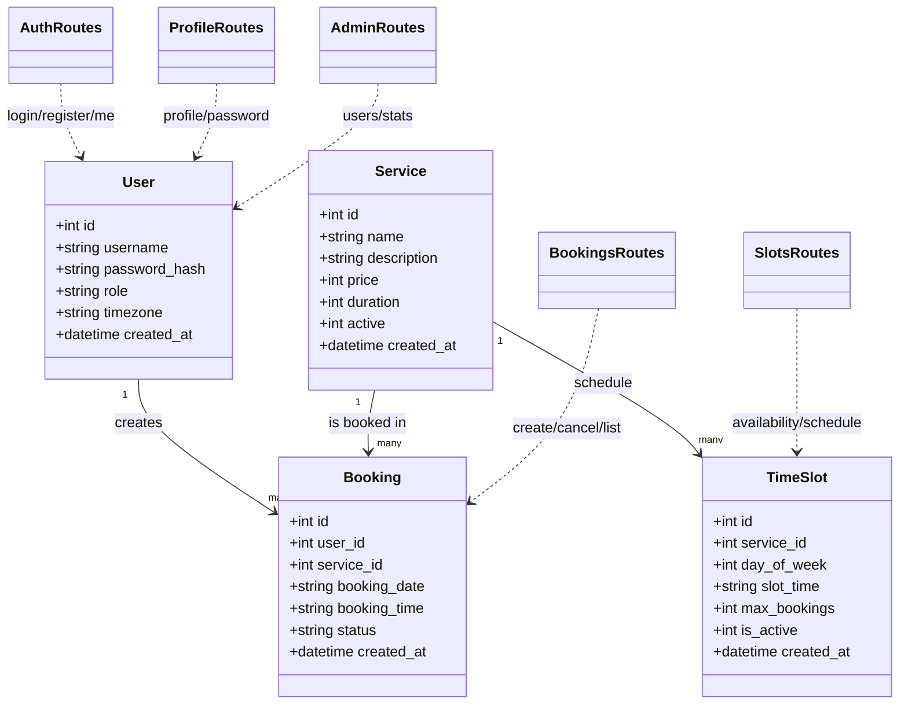

# UML Diagram

Ниже показана логическая UML-диаграмма основных сущностей и связей сервиса.

```mermaid
classDiagram
  class User {
    +int id
    +string username
    +string password_hash
    +string role
    +string timezone
    +datetime created_at
  }

  class Service {
    +int id
    +string name
    +string description
    +int price
    +int duration
    +int active
    +datetime created_at
  }

  class Booking {
    +int id
    +int user_id
    +int service_id
    +string booking_date
    +string booking_time
    +string status
    +datetime created_at
  }

  class TimeSlot {
    +int id
    +int service_id
    +int day_of_week
    +string slot_time
    +int max_bookings
    +int is_active
    +datetime created_at
  }

  class AuthRoutes
  class ProfileRoutes
  class BookingsRoutes
  class AdminRoutes
  class SlotsRoutes

  User "1" --> "many" Booking : creates
  Service "1" --> "many" Booking : is booked in
  Service "1" --> "many" TimeSlot : schedule

  AuthRoutes ..> User : login/register/me
  ProfileRoutes ..> User : profile/password
  BookingsRoutes ..> Booking : create/cancel/list
  AdminRoutes ..> User : users/stats
  SlotsRoutes ..> TimeSlot : availability/schedule
```
